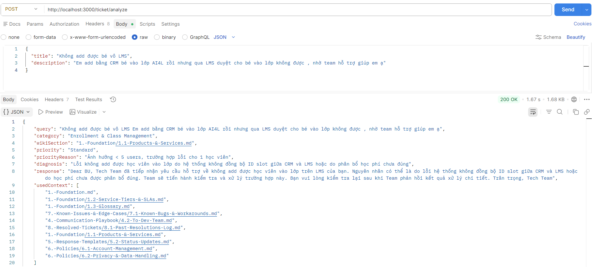

# Technical Documentation: MindX Ticket Automation System

## 1. Overview
The MindX Ticket Automation System is a tool designed to automatically analyze technical incidents and draft professional responses. The system operates as a **Wiki-driven engine**, meaning it uses the company's internal documentation (MindX CS Wiki) as its primary source of truth for making decisions and providing solutions.



---

## 2. Knowledge Source Structure (Wiki)
The system does not rely on hardcoded rules. Instead, it reads Markdown (`.md`) files directly from the Wiki directory. These files serve as the "Standard Operating Procedure" for the logic engine.

- **Section 1 (Foundation)**: Contains core definitions and the **Service Tiers & SLAs (File 1.2)** used to determine incident priority.
- **Section 5 (Response Templates)**: Provides the professional structure and tone for all communications.
- **Section 7 (Known Issues)**: A database of documented bugs and their existing workarounds.
- **Section 8 (Resolved Tickets)**: A log of past successful resolutions used for matching current issues with historical solutions.

---

## 3. System Architecture
The application follows the **Hexagonal (Ports and Adapters)** pattern to separate business logic from technical infrastructure:

- **Application Core**: Manages the main workflow logic (`analyze-ticket.ts`).
- **Ports**: Interfaces that define how the core interacts with external tools (`knowledge-search.port.ts`, `ai-generator.port.ts`).
- **Adapters**: The specific implementation of search tools (`wiki-search.ts`) and the logic processor (`openai.ts`).

---

## 4. Ticket Processing Workflow

Each ticket is processed through four strict stages:

### Stage 1: Parallel Knowledge Searching
Upon receiving a ticket, the system simultaneously searches four areas of the Wiki:
1.  **Rule Search**: Fetches SLA and Priority guidelines.
2.  **Operational Search**: Fetches product definitions and business policies.
3.  **History Search**: Identifies similar incidents resolved in the past (Section 8.1).
4.  **Template Search**: Finds the most appropriate response format (Section 5).

### Stage 2: Information Consolidation
The gathered data is filtered for duplicates, tagged with its source file path, and organized into a comprehensive "Context Package" for the logic processor.

### Stage 3: Logical Analysis & Drafting
The logic engine performs the following steps based on the gathered Wiki data:
1.  **Impact Assessment**: Calculates the number of affected users mentioned in the ticket and matches them against the SLA (File 1.2) to assign a priority level.
2.  **Incident Matching**: Compares the current symptoms with the historical log (File 8.1) to identify the most likely root cause.
3.  **Customized Drafting**: Uses the templates from Section 5 and populates them with specific details (student name, date, specific error type) found in the ticket.

### Stage 4: Output Delivery
The system returns a structured data package (JSON) containing the Category, Priority Level, Diagnostic Reason, Final Response Message, and the list of Wiki files used for the analysis.

---

## 5. Core Business Rules

### 5.1. Priority Assignment (Based on File 1.2)
- **Expedite (P1)**: Impacting > 25 users or total system failure.
- **Priority (P2)**: Impacting 5 to 25 users (Critical functional issues).
- **Standard (P3)**: Impacting < 5 users (Individual inquiries or minor errors).

### 5.2. Communication Persona
The system is strictly instructed to maintain a professional corporate tone:
- **Self-reference**: Must use "Team" or "Tech Team".
- **External reference**: Must use "BU" or "You".


---

## 6. Configuration & Setup
The system is configured via an `.env` file:
- `AI_API_KEY`: Authentication key for the logic service.
- `AI_BASE_URL`: Service endpoint (Default: Groq API).
- `AI_MODEL_NAME`: The specific processing model (Current: `llama-3.3-70b-versatile`).

---

## 7. Example
**Endpoint**: `POST /ticket/analyze`
**Request Format**:
```json
{
  "title": "Không add được bé vô LMS",
  "description": "Em add bằng CRM bé vào lớp AI4L rồi nhưng qua LMS duyệt cho bé vào lớp không được , nhờ team hỗ trợ giúp em ạ"
}
```
